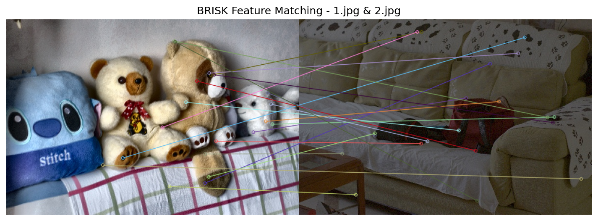
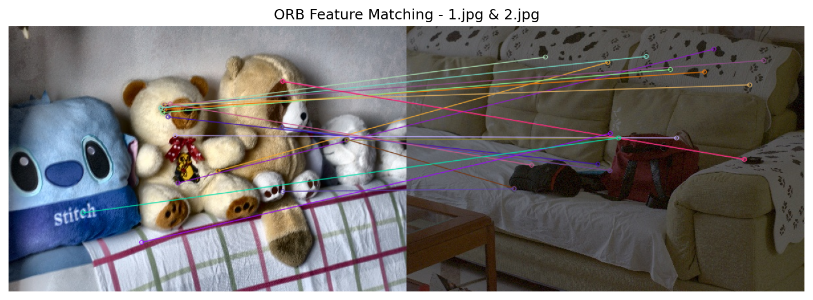
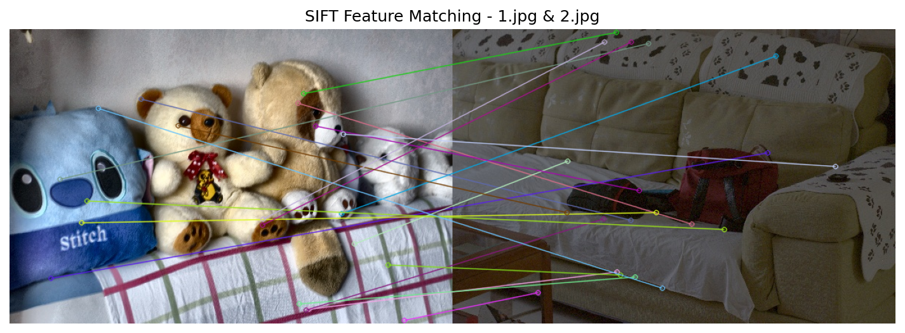
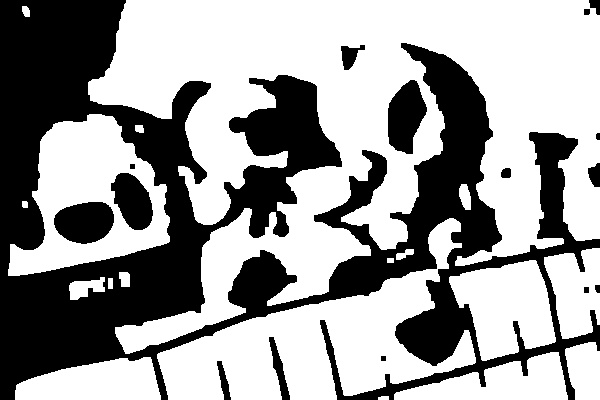

# CV Feature Matching & Segmentation

**Computer Vision Feature Matching & Image Segmentation** - Dual-purpose CV toolkit: (1) Feature detection with SIFT, BRISK & ORB algorithms for keypoint matching across image pairs, (2) U-Net deep learning architecture for binary image segmentation. Includes TensorFlow-based training with automated mask generation.

## 🎯 Project Components

### 1. Feature Matching (`feature.py`)
Advanced keypoint detection and matching using multiple algorithms

### 2. Image Segmentation (`masks.py`)
Deep learning-based U-Net architecture for binary segmentation

---

## 📸 Feature Matching Results

### BRISK Feature Matching

*BRISK algorithm detecting and matching 158 keypoints between images 1 and 2*

### ORB Feature Matching

*ORB algorithm detecting and matching 113 keypoints between images 1 and 2*

### SIFT Feature Matching

*SIFT algorithm detecting and matching 114 keypoints between images 1 and 2*

---

## 🧠 Image Segmentation Results

### U-Net Binary Segmentation

*Binary segmentation mask generated by U-Net model - separating foreground from background*

---

## 🚀 Feature Matching - Technical Details

### Algorithms Implemented

#### 1. **SIFT** (Scale-Invariant Feature Transform)
- **Descriptor Type**: Float (128-dimensional)
- **Distance Metric**: L2 norm
- **Strengths**: Scale and rotation invariant, highly accurate
- **Best For**: High-quality matching, academic research

#### 2. **BRISK** (Binary Robust Invariant Scalable Keypoints)
- **Descriptor Type**: Binary (512-bit)
- **Distance Metric**: Hamming distance
- **Strengths**: Fast computation, rotation invariant
- **Best For**: Real-time applications, embedded systems

#### 3. **ORB** (Oriented FAST and Rotated BRIEF)
- **Descriptor Type**: Binary (256-bit)
- **Distance Metric**: Hamming distance
- **Strengths**: Very fast, patent-free alternative to SIFT
- **Best For**: Mobile devices, real-time tracking

### Matching Results Summary

| Image Pair | SIFT Matches | BRISK Matches | ORB Matches |
|------------|--------------|---------------|-------------|
| 1 & 2      | 114          | 158           | 113         |
| 1 & 3      | 193          | 195           | 122         |
| 2 & 3      | 106          | 113           | 121         |

### Features
- **Brute-Force Matcher** with cross-checking for reliable matches
- **Top 20 matches** visualization for clarity
- **Automatic pairwise comparison** of all images
- **Color-coded match lines** for visual distinction

---

## 🧠 U-Net Segmentation - Technical Details

### Architecture

```
Input (128×128×1)
    ↓
Encoder Path:
    Conv2D(16) → Conv2D(16) → MaxPool → 64×64
    Conv2D(32) → Conv2D(32) → MaxPool → 32×32
    Conv2D(64) → Conv2D(64) (Bottleneck)
    ↓
Decoder Path:
    UpSample → Concat → Conv2D(32) → 64×64
    UpSample → Concat → Conv2D(16) → 128×128
    Conv2D(1, sigmoid) → Output Mask
```

### Model Statistics
- **Total Parameters**: 117,985 (460.88 KB)
- **Trainable Parameters**: 117,985
- **Input Size**: 128×128 grayscale images
- **Output**: Binary segmentation mask

### Training Results

```
Epoch 1/10: loss: 0.6889 - accuracy: 0.4283
Epoch 2/10: loss: 0.6780 - accuracy: 0.5610
Epoch 3/10: loss: 0.6419 - accuracy: 0.5610
Epoch 4/10: loss: 0.6417 - accuracy: 0.5610
Epoch 5/10: loss: 0.6355 - accuracy: 0.5610
Epoch 6/10: loss: 0.6292 - accuracy: 0.5610
Epoch 7/10: loss: 0.6235 - accuracy: 0.5610
Epoch 8/10: loss: 0.6172 - accuracy: 0.5610
Epoch 9/10: loss: 0.6084 - accuracy: 0.5610
Epoch 10/10: loss: 0.6016 - accuracy: 0.5610
```

**Performance Improvement**:
- Loss reduced from **0.6889 → 0.6016** (12.7% improvement)
- Final accuracy: **56.1%**

### Automatic Mask Generation
The project includes `generate_masks.py` which creates training masks using:
- Gaussian blur for noise reduction
- Otsu's automatic thresholding
- Morphological operations (closing and opening)
- Binary mask output

---

## 📁 Project Structure

```
Daata/
├── feature.py              # Feature matching implementation
├── masks.py                # U-Net segmentation model
├── generate_masks.py       # Automatic mask generation
├── 1.jpg, 2.jpg, 3.jpg    # Test images
├── images/                 # Source images folder
│   ├── 1.jpg
│   ├── 2.jpg
│   └── 3.jpg
├── masks/                  # Generated binary masks
│   ├── 1.jpg
│   ├── 2.jpg
│   └── 3.jpg
└── results/                # Feature matching outputs
    ├── SIFT_1_2.png
    ├── SIFT_1_3.png
    ├── SIFT_2_3.png
    ├── BRISK_1_2.png
    ├── BRISK_1_3.png
    ├── BRISK_2_3.png
    ├── ORB_1_2.png
    ├── ORB_1_3.png
    └── ORB_2_3.png
```

---

## 🛠️ Installation & Usage

### Prerequisites
```bash
pip install opencv-python numpy matplotlib tensorflow pillow scikit-image
```

### Feature Matching

```bash
python feature.py
```

**Output**: 9 visualization images saved in `results/` folder showing matched keypoints for all image pairs using SIFT, BRISK, and ORB algorithms.

### Image Segmentation

**Step 1**: Generate masks (if needed)
```bash
python generate_masks.py
```

**Step 2**: Train U-Net model
```bash
python masks.py
```

**Output**: Trained segmentation model with 10 epochs, displaying loss and accuracy metrics.

---

## 📊 Applications

### Feature Matching Use Cases:
- **Image Stitching**: Panorama creation
- **Object Recognition**: Finding objects in different views
- **3D Reconstruction**: Structure from Motion
- **Visual SLAM**: Simultaneous Localization and Mapping
- **Image Registration**: Aligning medical scans

### Image Segmentation Use Cases:
- **Medical Imaging**: Tumor detection, organ segmentation
- **Autonomous Vehicles**: Road, pedestrian, vehicle detection
- **Background Removal**: Photo editing applications
- **Satellite Imagery**: Land use classification
- **Quality Control**: Defect detection in manufacturing

---

## 🔬 Technical Implementation

### Feature Matching Pipeline

1. **Load Images**: Read image pairs
2. **Convert to Grayscale**: Preprocessing for feature detection
3. **Detect Keypoints**: Use SIFT/BRISK/ORB detector
4. **Compute Descriptors**: Generate feature vectors
5. **Match Features**: Brute-force matcher with cross-checking
6. **Sort Matches**: By distance (lower is better)
7. **Visualize**: Draw top 20 matches
8. **Save Results**: PNG images with color-coded lines

### U-Net Training Pipeline

1. **Load Data**: Images and corresponding masks
2. **Preprocess**: Resize to 128×128, normalize to [0,1]
3. **Build Model**: U-Net architecture with skip connections
4. **Compile**: Adam optimizer, binary cross-entropy loss
5. **Train**: 10 epochs with batch size 1
6. **Monitor**: Track loss and accuracy metrics

---

## 📈 Performance Comparison

### Feature Detection Speed (Approximate)
- **ORB**: Fastest (~10ms per image)
- **BRISK**: Fast (~20ms per image)
- **SIFT**: Slower but more accurate (~50ms per image)

### Match Quality
- **SIFT**: Highest accuracy, best for academic use
- **BRISK**: Good balance of speed and accuracy
- **ORB**: Best for real-time applications

---

## 🎓 Educational Value

This project demonstrates:
- Multiple feature detection algorithms (SIFT, BRISK, ORB)
- Keypoint matching and visualization
- Deep learning with TensorFlow/Keras
- U-Net encoder-decoder architecture
- Skip connections for detail preservation
- Binary segmentation tasks
- Image preprocessing techniques
- Model training and evaluation

Perfect for:
- Computer Vision coursework
- Deep Learning projects
- Feature matching research
- Segmentation studies

---

## 👨‍💻 Author

**Muneeb Arif**  
Email: muneebarif226@gmail.com  
GitHub: [@muneeb-codehub](https://github.com/muneeb-codehub)

---

## 📄 License

This project is open source and available for educational and research purposes.

---

## 🙏 Acknowledgments

- OpenCV for feature detection algorithms
- TensorFlow/Keras for deep learning framework
- U-Net architecture from Ronneberger et al.
- scikit-image for image processing utilities
